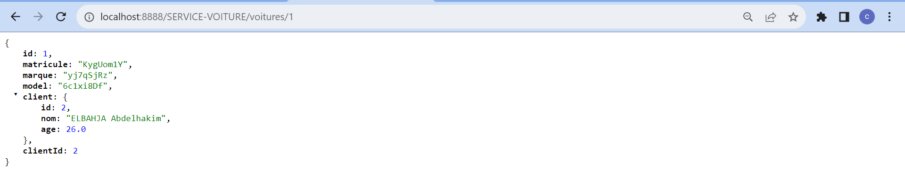
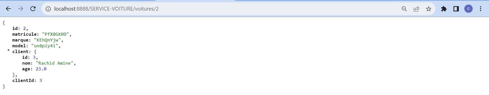

# app-microservices

This repository contains two microservices built with Spring Boot: "Client" and "Voiture" (French for "Client" and "Car").

## Installation
To run these Spring Boot microservices, follow these steps:
1. **Clone the Repository:**
   
   git clone https://github.com/elbahjacharafeddine/app-microservices.git
   cd app-microservices

## Screenshots
##### "Voiture" service database screenshot

##### "Client" service database screenshot

##### HTTP Requests

